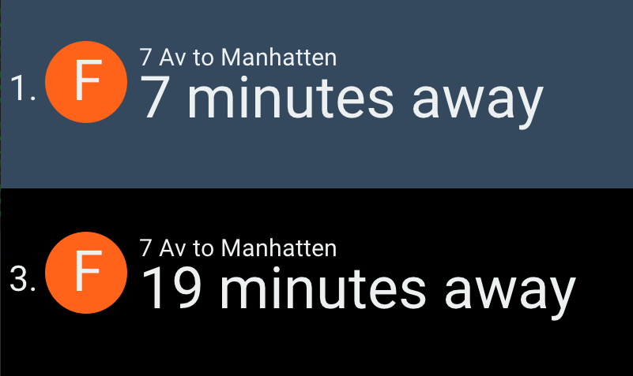

# mta-subway-time



## Windows Docker Setup

Launch XLaunch instance:
[XLaunch](https://x.cygwin.com/docs/xlaunch/index.html)

## Mac Docker Setup

```
brew install glew
brew install glfw
```

Launch Quartz instance:
[Quartz](https://gist.github.com/cschiewek/246a244ba23da8b9f0e7b11a68bf3285), with [original instructions](https://gist.github.com/cschiewek/246a244ba23da8b9f0e7b11a68bf3285)


## Google Transit Data

To download the latest google transit data used to load the base schedules, run:

```sh
./scripts/update_google_transit_data.sh
```

## Docker

### Docker Build

```
make docker-build
```

### Run on Windows

```
make windows-docker-run-with-x
```

### Run on Mac

```
make nix-docker-run
```

## ENV

```
export GTFS_API_KEY=
export GOOGLE_TRANSIT_DATA=
export TRANSIT_DATA_TIMEZONE=America/New_York
export WIFI_SSID=
export WIFI_PASS_OR_PSK=
```

## Targets

Configure the stop(s) you want to target by opening `config/config.exs` and editing the `subway_lines` declaration

```elixir
config :mta_subway_time, :subway_lines, [
  %{
    line: "F",
    stop_id: "F24N",
    direction: "Manhatten",
  },
]
```

The `stop_id` is found inside the Google Transit Data's `stops.txt` file. 
The `line` and `direction` parameters are simply for display.

## Running Locally

```sh
MIX_BUILD_PATH=~/build \
  MIX_DEPS_PATH=~/deps \
  MIX_TARGET=host \
  mix run --no-halt
```

## TODO
* BOM
* Model the casing unit